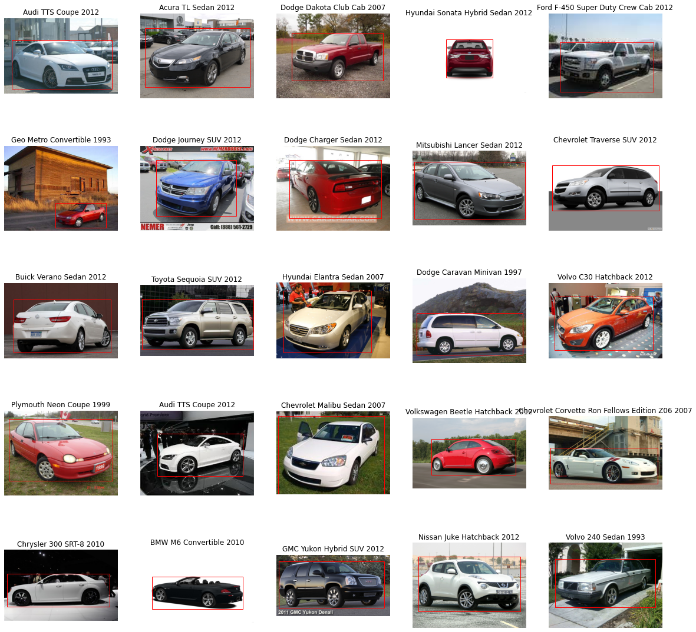

# Stanford Cars Dataset

Welcome to the Stanford Cars Dataset project! This dataset comprises 16,185 images spanning 196 classes of cars. The dataset is carefully split into 8,144 training images and 8,041 testing images, ensuring a balanced distribution across each class. Classes are defined at the level of Make, Model, and Year, offering a detailed categorization such as "2012 Tesla Model S" or "2012 BMW M3 coupe."

## Dataset Overview

- **Total Images:** 16,185
- **Classes:** 196
- **Training Images:** 8,144
- **Testing Images:** 8,041

For more details and to access the dataset, visit the [Stanford Cars Dataset page](https://ai.stanford.edu/~jkrause/cars/car_dataset.html).

## Transfer Learning Models

In an effort to leverage pre-trained models for image classification, I explored the following architectures:

1. **VGG16**
2. **InceptionV3**
3. **EfficientNetB0**
4. **MobileNetV2**

## Model Performance

After experimentation, MobileNetV2 emerged as the most promising model, achieving approximately:
- **Top-1 Test Accuracy:** ~60%
- **Top-5 Test Accuracy:** ~84%

Given the constraints of a slow processor and limited GPU usage time in Colab, the models were trained without extensive tuning. However, there is ample room for improvement through different models or fine-tuning approaches to achieve even better accuracy.

Feel free to explore alternative models and conduct further experiments to enhance the overall performance of the classification models.

